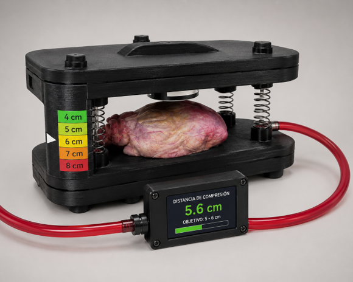
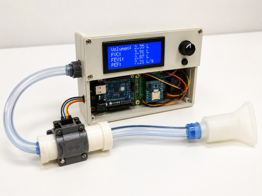
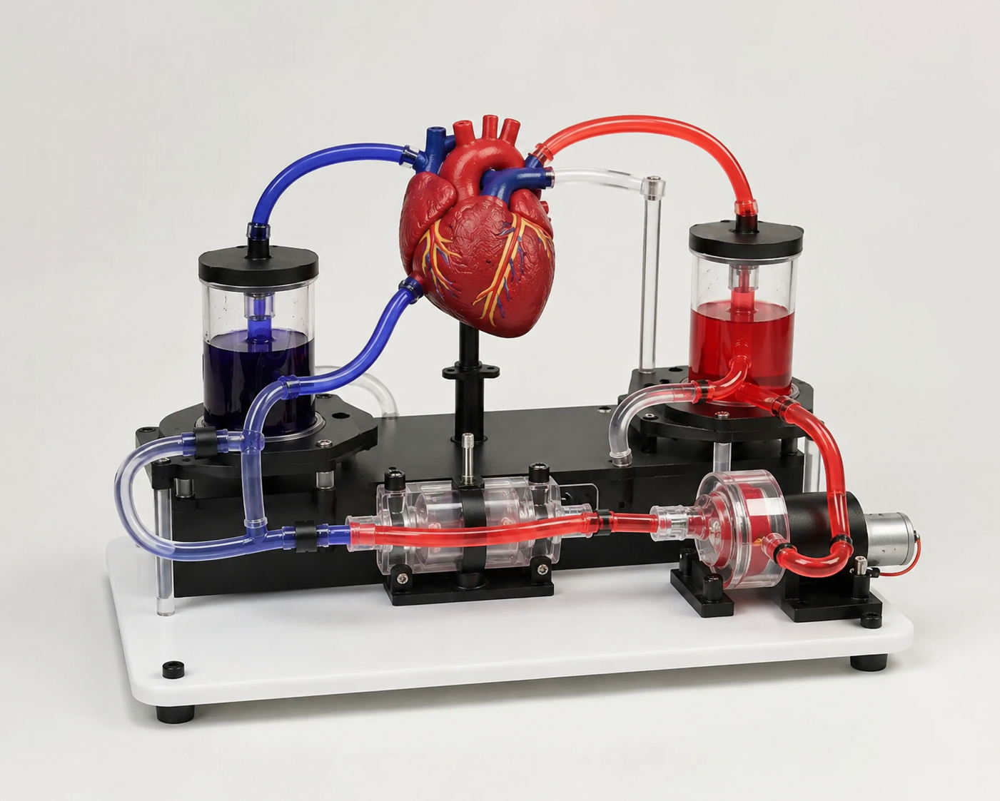

# CREATIBIO - Simulación Biomédica y Fisiológica

Repositorio correspondiente a la línea de Simulación Biomédica y Fisiológica de CREATIBIO.

Esta línea se enfoca en el desarrollo de simuladores, dispositivos didácticos y sistemas interactivos destinados a la enseñanza, entrenamiento y divulgación de conceptos biomédicos y fisiológicos.

Los desarrollos buscan integrar electrónica, sensores, programación, diseño 3D y principios de bioingeniería para la construcción de plataformas educativas de bajo costo y acceso abierto.

## Proyectos

### Simulador de RCP

Desarrollo de un simulador capaz de registrar y visualizar parámetros asociados a maniobras de reanimación cardiopulmonar.

### Simulador de sistema circulatorio

Modelo funcional para visualizar fenómenos de flujo, presión y pulso mediante sensores y sistemas de monitoreo.

### Simulador de sistema respiratorio

Plataforma didáctica para representar mecánica respiratoria y dinámica de flujo de aire.

### Espirómetro electrónico

Sistema de adquisición y visualización de variables respiratorias basado en sensores y microcontroladores.

## Contenido del repositorio

- Diseños CAD
- Electrónica y firmware
- Documentación técnica
- Protocolos de validación
- Material de apoyo
- Imágenes y prototipos proyectados

## Capacidades involucradas

- Bioingeniería
- Simulación biomédica
- Sensores
- Electrónica aplicada
- Arduino y sistemas embebidos
- Procesamiento de señales
- Diseño CAD e impresión 3D
- Desarrollo de prototipos

## Prototipos proyectados

## Organización

Responsable de línea:
- Mara Fusco

CREATIBIO – IUDPT
